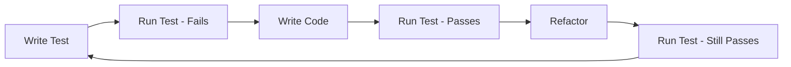

# Form-Bridge MVP v1 Implementation Plan

*Version: 1.0 | Date: January 2025*  
*Methodology: Test-Driven Development | Timeline: 4 Weeks*

## Executive Summary
This document provides a concrete, phase-by-phase implementation plan for building Form-Bridge MVP using Claude Code, following TDD principles and the cost-optimized v3 architecture ($4.50/month operational cost).

---

## 🏗️ Directory Structure (Optimized for Claude Code & Humans)

```
form-bridge/
├── .claude/
│   ├── hooks.json              # Development workflow automation
│   └── agents/
│       └── strategies/         # Agent-specific knowledge
├── services/                   # Lambda functions by domain
│   ├── ingestion/
│   │   ├── webhook_handler/
│   │   │   ├── handler.py
│   │   │   ├── test_handler.py
│   │   │   └── requirements.txt
│   │   └── api_gateway_auth/
│   ├── processing/
│   │   ├── event_router/
│   │   └── transformer/
│   ├── storage/
│   │   ├── dynamodb_writer/
│   │   └── query_handler/
│   └── delivery/
│       ├── webhook_sender/
│       ├── email_sender/
│       └── slack_sender/
├── plugins/                    # Platform-specific plugins
│   ├── wordpress/
│   │   ├── src/
│   │   ├── tests/
│   │   └── build.sh
│   └── universal/              # Shared plugin core
│       └── core.js
├── dashboard/                  # React admin UI
│   ├── src/
│   │   ├── pages/
│   │   ├── components/
│   │   └── services/
│   └── tests/
├── infrastructure/            # IaC definitions
│   ├── sam/
│   │   └── template.yaml
│   ├── terraform/            # Future option
│   └── scripts/
│       ├── deploy.sh
│       └── test.sh
├── shared/                    # Shared libraries
│   ├── python/
│   │   ├── auth.py
│   │   ├── dynamodb.py
│   │   └── encryption.py
│   └── typescript/
│       └── types.ts
├── tests/                     # Integration & E2E tests
│   ├── integration/
│   └── e2e/
└── docs/
    ├── api/
    ├── architecture/
    ├── guides/
    └── strategies/
```

---

## 📋 Phase 1: Foundation & Infrastructure (Week 1)

### Day 1-2: Project Setup & Configuration

#### Tasks:
```markdown
- [ ] Initialize repository with optimized structure
- [ ] Configure Claude Code hooks.json
- [ ] Set up Python/Node environments
- [ ] Install testing frameworks (pytest, jest)
- [ ] Create initial SAM template
- [ ] Configure DynamoDB local for testing
```

#### Test First (TDD):
```python
# tests/unit/test_project_setup.py
def test_directory_structure_exists():
    """Verify all required directories are created"""
    required_dirs = [
        'services/ingestion',
        'services/processing',
        'plugins/wordpress',
        'dashboard/src'
    ]
    for dir_path in required_dirs:
        assert Path(dir_path).exists()

def test_hooks_configuration():
    """Verify Claude Code hooks are properly configured"""
    with open('.claude/hooks.json') as f:
        hooks = json.load(f)
    assert 'security_check' in hooks
    assert 'format_on_save' in hooks
```

### Day 3-4: DynamoDB & Core Infrastructure

#### Tasks:
```markdown
- [ ] Create DynamoDB table with single-table design
- [ ] Implement AWS-owned key encryption (free)
- [ ] Set up basic Lambda functions structure
- [ ] Configure API Gateway with throttling
- [ ] Implement cost-optimized encryption utilities
```

#### Test First:
```python
# services/storage/test_dynamodb_setup.py
class TestDynamoDBSetup:
    def test_table_creation(self):
        """Test DynamoDB table can be created with correct settings"""
        table_config = {
            'TableName': 'FormBridge',
            'BillingMode': 'PAY_PER_REQUEST',
            'SSESpecification': {
                'Enabled': True,
                'SSEType': 'DEFAULT'  # AWS-owned keys
            }
        }
        # Test implementation here

    def test_single_table_patterns(self):
        """Test all access patterns work with single table"""
        patterns = [
            ('TENANT#abc', 'METADATA'),
            ('TENANT#abc', 'SITE#xyz'),
            ('SUBMISSION#123', 'TIMESTAMP#2025-01-26')
        ]
        # Test each pattern
```

#### Implementation:
```python
# shared/python/dynamodb.py
import boto3
from typing import Dict, Any, Optional
from dataclasses import dataclass

@dataclass
class DynamoDBConfig:
    table_name: str = 'FormBridge'
    region: str = 'us-east-1'
    
class DynamoDBManager:
    """Single table design manager"""
    
    def __init__(self, config: DynamoDBConfig):
        self.table = boto3.resource('dynamodb').Table(config.table_name)
        
    def put_tenant(self, tenant_id: str, metadata: Dict[str, Any]) -> None:
        """Store tenant metadata"""
        self.table.put_item(
            Item={
                'pk': f'TENANT#{tenant_id}',
                'sk': 'METADATA',
                **metadata
            }
        )
    
    def put_site(self, tenant_id: str, site_id: str, data: Dict) -> None:
        """Store site registration"""
        self.table.put_item(
            Item={
                'pk': f'TENANT#{tenant_id}',
                'sk': f'SITE#{site_id}',
                **data
            }
        )
```

### Day 5: Authentication & Security Layer

#### Tasks:
```markdown
- [ ] Implement AES-256-GCM encryption (no KMS)
- [ ] Create HMAC authentication utilities
- [ ] Set up Lambda authorizer
- [ ] Implement rate limiting with DynamoDB
- [ ] Create security configuration manager
```

#### Test First:
```python
# shared/python/test_encryption.py
class TestEncryption:
    def test_aes_encryption(self):
        """Test AES-256-GCM encryption without KMS"""
        encryptor = AESEncryptor(master_secret="test_secret")
        
        plaintext = "sensitive_api_key"
        encrypted = encryptor.encrypt(plaintext, tenant_id="test")
        decrypted = encryptor.decrypt(encrypted, tenant_id="test")
        
        assert decrypted == plaintext
        assert encrypted != plaintext
    
    def test_key_derivation(self):
        """Test PBKDF2 key derivation for multi-tenancy"""
        key1 = derive_tenant_key("master", "tenant1")
        key2 = derive_tenant_key("master", "tenant2")
        
        assert key1 != key2
        assert len(key1) == 32  # 256 bits
```

---

## 📋 Phase 2: Core Services & Event Processing (Week 2)

### Day 6-7: Ingestion Service

#### Tasks:
```markdown
- [ ] Create webhook handler Lambda
- [ ] Implement HMAC signature validation
- [ ] Add request validation & sanitization
- [ ] Create EventBridge event publisher
- [ ] Set up CloudWatch logging (sampled)
```

#### Test First:
```python
# services/ingestion/webhook_handler/test_handler.py
class TestWebhookHandler:
    def test_valid_hmac_signature(self):
        """Test HMAC signature validation"""
        body = json.dumps({"form": "data"})
        secret = "webhook_secret"
        signature = hmac.new(
            secret.encode(),
            body.encode(),
            hashlib.sha256
        ).hexdigest()
        
        result = validate_hmac(body, signature, secret)
        assert result == True
    
    def test_event_publishing(self):
        """Test event is published to EventBridge"""
        with mock_eventbridge() as eb:
            handle_webhook({
                'body': '{"test": "data"}',
                'headers': {'X-Signature': 'valid'}
            })
            
            assert eb.put_events.called
            event = eb.put_events.call_args[0][0]
            assert event['Source'] == 'formbridge.ingestion'
```

#### Implementation:
```python
# services/ingestion/webhook_handler/handler.py
import json
import hmac
import hashlib
import os
import boto3

eventbridge = boto3.client('events')

def lambda_handler(event, context):
    """Main webhook handler"""
    try:
        # Validate HMAC
        if not validate_hmac(event):
            return {'statusCode': 401, 'body': 'Invalid signature'}
        
        # Parse and validate payload
        body = json.loads(event['body'])
        tenant_id = extract_tenant_id(event)
        
        # Publish to EventBridge
        eventbridge.put_events(
            Entries=[{
                'Source': 'formbridge.ingestion',
                'DetailType': 'submission.received',
                'Detail': json.dumps({
                    'tenant_id': tenant_id,
                    'submission': body,
                    'metadata': {
                        'received_at': datetime.utcnow().isoformat(),
                        'source_ip': event['requestContext']['identity']['sourceIp']
                    }
                })
            }]
        )
        
        return {'statusCode': 200, 'body': 'Accepted'}
        
    except Exception as e:
        log_error(e, sample_rate=0.1)  # Cost-optimized logging
        return {'statusCode': 500, 'body': 'Internal error'}
```

### Day 8-9: Processing & Routing

#### Tasks:
```markdown
- [ ] Create EventBridge rules for routing
- [ ] Implement event transformer Lambda
- [ ] Add destination router logic
- [ ] Create error handling & DLQ
- [ ] Set up retry logic with exponential backoff
```

#### Test First:
```python
# services/processing/event_router/test_router.py
class TestEventRouter:
    def test_route_to_multiple_destinations(self):
        """Test event routing to multiple destinations"""
        event = {
            'tenant_id': 'test_tenant',
            'destinations': ['email', 'slack', 'webhook']
        }
        
        routes = determine_routes(event)
        assert len(routes) == 3
        assert 'email' in routes
```

### Day 10: Storage Service

#### Tasks:
```markdown
- [ ] Implement DynamoDB writer Lambda
- [ ] Add submission storage with TTL
- [ ] Create query handler for retrieval
- [ ] Implement pagination support
- [ ] Add data retention policies
```

---

## 📋 Phase 3: Plugin & Dashboard Development (Week 3)

### Day 11-12: WordPress Plugin

#### Tasks:
```markdown
- [ ] Create universal plugin core
- [ ] Implement WordPress adapter
- [ ] Add HMAC authentication
- [ ] Create auto-update mechanism
- [ ] Build settings UI
```

#### Test First:
```php
// plugins/wordpress/tests/test_plugin.php
class TestFormBridgePlugin extends WP_UnitTestCase {
    
    public function test_plugin_activation() {
        activate_plugin('formbridge/formbridge.php');
        $this->assertTrue(is_plugin_active('formbridge/formbridge.php'));
    }
    
    public function test_hmac_generation() {
        $data = array('test' => 'data');
        $secret = 'test_secret';
        
        $signature = FormBridge::generate_hmac($data, $secret);
        $this->assertNotEmpty($signature);
        $this->assertEquals(64, strlen($signature)); // SHA256 = 64 chars
    }
}
```

#### Implementation:
```php
// plugins/wordpress/src/formbridge.php
<?php
/**
 * Plugin Name: FormBridge
 * Version: 1.0.0
 * Description: Universal form routing to any destination
 */

class FormBridge {
    private $api_endpoint;
    private $tenant_id;
    private $api_key;
    
    public function __construct() {
        $this->load_config();
        add_action('init', [$this, 'init']);
        add_filter('gform_after_submission', [$this, 'handle_form_submission'], 10, 2);
    }
    
    public function handle_form_submission($entry, $form) {
        $payload = $this->prepare_payload($entry, $form);
        $signature = $this->generate_hmac($payload);
        
        wp_remote_post($this->api_endpoint, [
            'body' => json_encode($payload),
            'headers' => [
                'Content-Type' => 'application/json',
                'X-Signature' => $signature,
                'X-Tenant-ID' => $this->tenant_id
            ],
            'timeout' => 10
        ]);
    }
}
```

### Day 13-15: React Dashboard

#### Tasks:
```markdown
- [ ] Set up React with Vite
- [ ] Implement authentication flow
- [ ] Create dashboard layout
- [ ] Add site management CRUD
- [ ] Build destination configuration
- [ ] Implement real-time monitoring
```

#### Test First:
```typescript
// dashboard/src/services/__tests__/api.test.ts
describe('API Service', () => {
    it('should authenticate user', async () => {
        const result = await authService.login('test@example.com', 'password');
        expect(result.token).toBeDefined();
        expect(result.tenant_id).toBeDefined();
    });
    
    it('should fetch sites with pagination', async () => {
        const sites = await apiService.getSites({ page: 1, limit: 10 });
        expect(sites.items).toHaveLength(10);
        expect(sites.total).toBeGreaterThan(0);
    });
});
```

#### Implementation:
```typescript
// dashboard/src/pages/Dashboard.tsx
import React, { useState, useEffect } from 'react';
import { useQuery } from '@tanstack/react-query';
import { Card, Grid, Metric, Text } from '@tremor/react';

export const Dashboard: React.FC = () => {
    const { data: metrics } = useQuery({
        queryKey: ['metrics'],
        queryFn: fetchMetrics,
        refetchInterval: 5000  // Poll every 5 seconds
    });
    
    return (
        <Grid numCols={3} className="gap-6">
            <Card>
                <Text>Total Submissions</Text>
                <Metric>{metrics?.total || 0}</Metric>
            </Card>
            <Card>
                <Text>Success Rate</Text>
                <Metric>{metrics?.successRate || 0}%</Metric>
            </Card>
            <Card>
                <Text>Active Sites</Text>
                <Metric>{metrics?.activeSites || 0}</Metric>
            </Card>
        </Grid>
    );
};
```

---

## 📋 Phase 4: Integration & Launch (Week 4)

### Day 16-17: Destination Connectors

#### Tasks:
```markdown
- [ ] Implement email destination
- [ ] Create Slack connector
- [ ] Add webhook destination
- [ ] Build Salesforce connector (basic)
- [ ] Test all connectors
```

### Day 18-19: Testing & Optimization

#### Tasks:
```markdown
- [ ] Run full integration tests
- [ ] Performance testing (load test)
- [ ] Security audit
- [ ] Cost analysis verification
- [ ] Documentation completion
```

### Day 20: Deployment & Launch

#### Tasks:
```markdown
- [ ] Deploy to AWS
- [ ] Configure production monitoring
- [ ] Set up alerting
- [ ] Launch beta program
- [ ] Gather initial feedback
```

---

## 🧪 Test-Driven Development Strategy

### Testing Pyramid
```
         /\
        /E2E\       (10%) - Critical user journeys
       /------\
      /  Intg  \    (20%) - Service integration
     /----------\
    /    Unit    \  (70%) - Component logic
   /--------------\
```

### TDD Workflow


### Test Coverage Goals
- **Critical paths**: 100% coverage
- **Core services**: 80% coverage
- **UI components**: 70% coverage
- **Utilities**: 90% coverage

---

## 🪝 Claude Code Hooks Configuration

```json
{
  "security_check": {
    "trigger": "on_file_edit",
    "pattern": "*.py|*.js|*.php",
    "action": "check_security_vulnerabilities"
  },
  "format_on_save": {
    "trigger": "on_save",
    "pattern": "*.py",
    "action": "black_format"
  },
  "test_on_change": {
    "trigger": "on_file_change",
    "pattern": "**/test_*.py",
    "action": "run_pytest"
  },
  "dynamodb_optimization": {
    "trigger": "on_query_write",
    "action": "suggest_query_optimization"
  },
  "cost_estimation": {
    "trigger": "on_infrastructure_change",
    "action": "estimate_aws_costs"
  }
}
```

---

## 📝 Master TODO List

### Week 1: Foundation
```markdown
## Infrastructure Setup
- [ ] Create AWS account and configure CLI
- [ ] Set up GitHub repository
- [ ] Configure CI/CD pipeline (GitHub Actions)
- [ ] Install development tools
- [ ] Configure local testing environment

## DynamoDB & Core
- [ ] Create DynamoDB table (single-table design)
- [ ] Write access pattern tests
- [ ] Implement encryption utilities
- [ ] Create rate limiting logic
- [ ] Set up CloudWatch logging

## Security Layer
- [ ] Implement AES encryption (no KMS)
- [ ] Create HMAC utilities
- [ ] Build Lambda authorizer
- [ ] Add DynamoDB rate limiting
- [ ] Configure security policies
```

### Week 2: Services
```markdown
## Ingestion Service
- [ ] Create webhook handler Lambda
- [ ] Add HMAC validation
- [ ] Implement request validation
- [ ] Set up EventBridge publisher
- [ ] Configure error handling

## Processing Service
- [ ] Create event router
- [ ] Build transformer Lambda
- [ ] Add destination routing
- [ ] Implement retry logic
- [ ] Set up DLQ

## Storage Service
- [ ] Build DynamoDB writer
- [ ] Add TTL configuration
- [ ] Create query handler
- [ ] Implement pagination
- [ ] Add retention policies
```

### Week 3: Frontend
```markdown
## WordPress Plugin
- [ ] Create plugin structure
- [ ] Build universal core
- [ ] Add WordPress adapter
- [ ] Implement settings UI
- [ ] Add auto-update logic

## React Dashboard
- [ ] Initialize React app
- [ ] Set up routing
- [ ] Create auth flow
- [ ] Build dashboard components
- [ ] Add site management
- [ ] Implement monitoring
```

### Week 4: Launch
```markdown
## Integration
- [ ] Connect all services
- [ ] Test end-to-end flow
- [ ] Add destination connectors
- [ ] Verify cost targets
- [ ] Complete documentation

## Deployment
- [ ] Deploy to production
- [ ] Configure monitoring
- [ ] Set up alerts
- [ ] Launch beta
- [ ] Gather feedback
```

---

## 📊 Success Criteria

### Technical Metrics
- [ ] 5-minute setup achieved
- [ ] < $5/month operational cost
- [ ] 99.9% uptime
- [ ] < 200ms API response time
- [ ] 80% test coverage

### Business Metrics
- [ ] 10 beta users onboarded
- [ ] 100 form submissions processed
- [ ] 3 destination types working
- [ ] 0 security incidents
- [ ] < 5 support tickets

---

## 🚀 Agent Strategies

### Development Workflow
1. **Principal Engineer** reviews architecture decisions
2. **Lambda Expert** optimizes serverless functions
3. **DynamoDB Architect** validates data patterns
4. **Frontend Specialist** reviews React code
5. **Security Expert** audits implementations
6. **Test Engineer** ensures coverage goals

### Communication Protocol
```markdown
Daily standup topics:
- Blockers identified
- Tests written vs passing
- Cost tracking
- Security concerns
- Documentation updates
```

---

## 📈 Risk Mitigation

### Technical Risks
| Risk | Mitigation | Owner |
|------|------------|-------|
| DynamoDB hot partitions | Use distributed keys | DynamoDB Architect |
| Lambda cold starts | Keep packages small | Lambda Expert |
| Cost overrun | Daily monitoring | Principal Engineer |
| Security breach | Automated scanning | Security Expert |

### Business Risks
| Risk | Mitigation | Owner |
|------|------------|-------|
| Low adoption | User feedback loops | Product Owner |
| Complex onboarding | Simplify flow | UX Designer |
| Support burden | Better documentation | Tech Writer |

---

## 🎯 Next Steps

1. **Immediate (Today)**:
   - Review and approve this plan
   - Set up development environment
   - Create GitHub repository
   - Initialize project structure

2. **Tomorrow**:
   - Begin Phase 1 implementation
   - Write first tests (TDD)
   - Set up CI/CD pipeline
   - Configure monitoring

3. **This Week**:
   - Complete foundation phase
   - Deploy first Lambda function
   - Test DynamoDB patterns
   - Validate cost model

---

This plan provides a clear, actionable path to building Form-Bridge MVP in 4 weeks using TDD methodology, optimized directory structure, and Claude Code best practices while maintaining < $5/month operational costs.