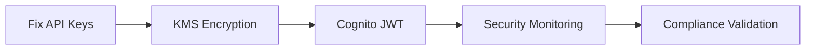

# Security Documentation

*Last Updated: January 26, 2025*

## Purpose

This directory contains all security-related documentation for the Form-Bridge project, including security audits, implementation plans, authentication strategies, and monitoring architectures.

## Documents Overview

### Active Security Plans

#### 1. **CRITICAL_SECURITY_IMPLEMENTATION_PLAN.md** (1187 lines)
- **Purpose**: Comprehensive security implementation roadmap with critical fixes
- **Status**: ACTIVE - Implementation in progress
- **Key Topics**: Multi-tenant isolation, encryption strategies, compliance requirements
- **Priority**: CRITICAL

#### 2. **cognito-jwt-integration-plan.md** (1218 lines)
- **Purpose**: AWS Cognito integration for JWT-based authentication
- **Status**: ACTIVE - Planning phase
- **Key Topics**: JWT validation, Cognito user pools, API Gateway integration
- **Related**: Works with API Gateway authentication layer

#### 3. **security-monitoring-architecture.md** (937 lines)
- **Purpose**: Real-time security monitoring and alerting architecture
- **Status**: ACTIVE - Design phase
- **Key Topics**: CloudWatch integration, security metrics, anomaly detection
- **Dependencies**: Requires CloudWatch, X-Ray setup

### Security Audits

#### 4. **comprehensive-security-audit-jan-2025.md** (1027 lines)
- **Purpose**: Full security assessment with cost-optimization trade-offs
- **Date**: January 26, 2025
- **Auditor**: Monitoring & Observability Expert
- **Key Findings**: KMS encryption gaps, tenant isolation concerns
- **Status**: Current - Findings being addressed

#### 5. **security-audit-jan-2025.md** (912 lines)
- **Purpose**: API key security audit and hierarchical key derivation
- **Date**: January 26, 2025
- **Auditor**: Principal Engineer
- **Key Findings**: Single API key vulnerability across WordPress sites
- **Status**: Current - Critical fix required

## Security Priorities (Q1 2025)

1. **CRITICAL**: Fix single API key vulnerability (security-audit-jan-2025.md)
2. **HIGH**: Implement tenant-specific KMS encryption (comprehensive-security-audit)
3. **HIGH**: Deploy Cognito JWT authentication (cognito-jwt-integration-plan.md)
4. **MEDIUM**: Establish security monitoring (security-monitoring-architecture.md)

## Implementation Sequence



## Related Documentation

- **Infrastructure**: `/infrastructure/sam/` - Security configurations in SAM templates
- **Testing**: `/docs/testing/` - Security testing plans
- **Strategies**: `/docs/strategies/cognito-auth-expert-strategy.md`

## Security Standards Compliance

- **AWS Well-Architected**: Security Pillar compliance
- **OWASP Top 10**: Addressed in implementation plans
- **SOC 2**: Audit trail requirements covered
- **GDPR**: Data protection measures included

## Quick Reference

### Critical Security Files
```bash
# View critical security plan
cat CRITICAL_SECURITY_IMPLEMENTATION_PLAN.md

# Check latest audit findings
cat comprehensive-security-audit-jan-2025.md

# Review API key fix
cat security-audit-jan-2025.md
```

### Security Testing
```bash
# Run security tests (from project root)
pytest tests/security/

# Security scanning
npm audit
pip-audit
```

## Maintenance Notes

- Security audits should be performed quarterly
- Update implementation plans after each sprint
- Archive completed security initiatives
- Keep authentication documentation current

## Contact

- **Security Lead**: Principal Engineer
- **Authentication**: Cognito Auth Expert
- **Monitoring**: Monitoring & Observability Expert

---
*All security documentation must be reviewed before implementation. Critical findings require immediate attention.*