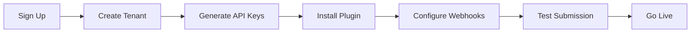
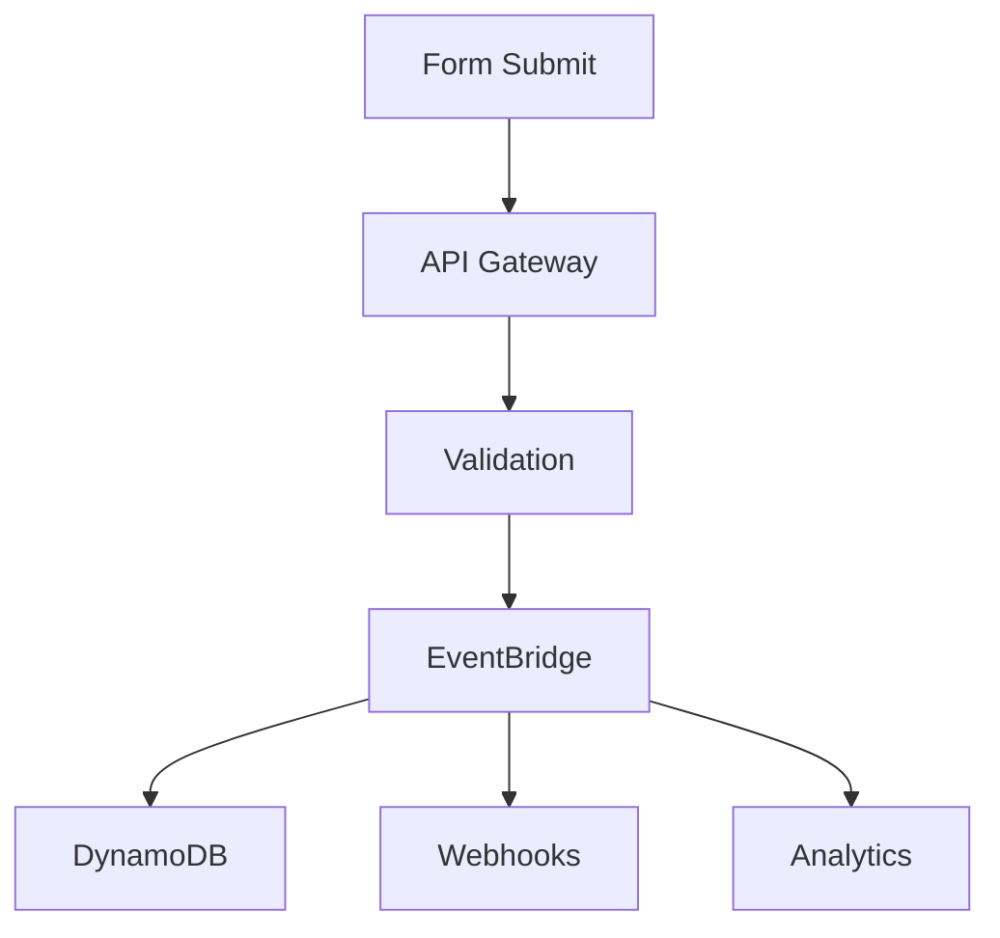

# Workflows Documentation

*Last Updated: January 26, 2025*

## Purpose

This directory contains documentation for all business processes, user workflows, onboarding procedures, and operational workflows within the Form-Bridge system.

## Documents Overview

### Onboarding Workflows

#### 1. **form-bridge-onboarding-workflow-v3.md**
- **Purpose**: Current tenant onboarding workflow (Version 3)
- **Status**: ACTIVE - Current implementation
- **Key Topics**: WordPress plugin setup, API key generation, webhook configuration
- **Improvements**: Enhanced security, streamlined UX, multi-site support

## Workflow Categories

### 1. Tenant Onboarding
Complete process for new tenant setup and configuration.



### 2. Form Submission Processing
End-to-end flow from form submission to delivery.



### 3. Administrative Workflows
Internal processes for system management.

- Tenant management
- Monitoring and alerts
- Incident response
- Backup and recovery

## Detailed Workflows

### New Tenant Onboarding (V3)

#### Phase 1: Account Setup
1. User signs up via dashboard
2. Email verification
3. Tenant profile creation
4. Subscription plan selection

#### Phase 2: Technical Configuration
1. Generate tenant ID
2. Create API credentials
3. Configure DynamoDB partition
4. Set up EventBridge rules

#### Phase 3: Plugin Installation
1. Download WordPress plugin
2. Install and activate
3. Enter API credentials
4. Configure form mappings

#### Phase 4: Testing & Validation
1. Submit test form
2. Verify data in dashboard
3. Test webhook delivery
4. Confirm analytics

#### Phase 5: Production Launch
1. Switch to production mode
2. Monitor initial submissions
3. Set up alerts
4. Documentation handoff

### Form Submission Workflow

#### Step 1: Ingestion
- Receive POST request
- Validate HMAC signature
- Check rate limits
- Parse form data

#### Step 2: Processing
- Schema validation
- Data transformation
- Enrichment (GeoIP, etc.)
- Deduplication check

#### Step 3: Storage
- Write to DynamoDB
- Update aggregates
- Archive raw data
- Generate submission ID

#### Step 4: Distribution
- Publish to EventBridge
- Trigger webhooks
- Send notifications
- Update analytics

#### Step 5: Confirmation
- Return success response
- Log transaction
- Update metrics
- Handle errors

## Workflow Automation

### Automated Processes
1. **Tenant Provisioning**: CloudFormation/CDK
2. **API Key Rotation**: Lambda + Secrets Manager
3. **Webhook Retries**: Step Functions
4. **Monitoring Alerts**: CloudWatch

### Manual Processes
1. **Tenant Approval**: Admin review
2. **Custom Integrations**: Engineering support
3. **Incident Response**: On-call team
4. **Feature Requests**: Product review

## User Journeys

### WordPress Site Owner
```
1. Discover Form-Bridge
2. Sign up for account
3. Install WordPress plugin
4. Configure forms
5. Monitor submissions
6. Set up integrations
```

### Developer Integration
```
1. Review API documentation
2. Obtain API credentials
3. Implement integration
4. Test in sandbox
5. Deploy to production
6. Monitor performance
```

### Administrator Tasks
```
1. Review new signups
2. Monitor system health
3. Respond to alerts
4. Generate reports
5. Update configurations
6. Support users
```

## Error Handling Workflows

### Submission Failures
1. Log error details
2. Send to DLQ
3. Alert monitoring
4. Retry if transient
5. Notify tenant if persistent

### Integration Failures
1. Capture error context
2. Implement exponential backoff
3. Alert after threshold
4. Provide fallback
5. Document resolution

## Performance Optimization

### Caching Strategy
- API Gateway caching
- CloudFront for static assets
- DynamoDB DAX for reads
- Lambda container reuse

### Scaling Workflows
- Auto-scaling triggers
- Concurrency limits
- Throttling policies
- Burst capacity planning

## Compliance Workflows

### Data Privacy
- GDPR compliance checks
- Data retention policies
- Right to deletion
- Data portability

### Security Workflows
- API key rotation
- Security audits
- Penetration testing
- Incident response

## Workflow Metrics

### Key Performance Indicators
- Onboarding completion rate: > 80%
- Time to first submission: < 30 minutes
- Workflow success rate: > 99.9%
- Error resolution time: < 1 hour

### Monitoring Points
- API Gateway metrics
- Lambda invocations
- DynamoDB operations
- EventBridge events
- Webhook deliveries

## Related Documentation

- **Architecture**: `/docs/architecture/` - System design
- **API**: `/docs/api/` - API specifications
- **Frontend**: `/docs/frontend/` - Dashboard workflows
- **Security**: `/docs/security/` - Security procedures

## Workflow Testing

### Test Scenarios
1. Happy path testing
2. Error condition handling
3. Edge case validation
4. Load testing
5. Failover testing

### Test Data
- Sample tenant configurations
- Test form submissions
- Mock webhook endpoints
- Synthetic transactions

## Improvement Tracking

### Current Version: V3
- Enhanced security model
- Improved onboarding UX
- Multi-site support
- Better error handling

### Planned Improvements (V4)
- Self-service portal
- Automated testing
- Advanced analytics
- Custom workflows

## Quick Reference

### Common Tasks
```bash
# Create new tenant
aws lambda invoke --function-name create-tenant

# Test form submission
curl -X POST https://api.form-bridge.com/submit \
  -H "X-API-Key: test-key" \
  -d @test-form.json

# Check workflow status
aws stepfunctions describe-execution \
  --execution-arn arn:aws:states:...
```

### Workflow Commands
```bash
# Start onboarding
npm run onboard:new-tenant

# Process submissions
npm run process:submissions

# Generate reports
npm run reports:generate
```

## Maintenance Notes

- Review workflows quarterly
- Update based on user feedback
- Archive deprecated versions
- Document lessons learned

## Version History

- **V1**: Basic onboarding (Archived)
- **V2**: Enhanced security (Archived)
- **V3**: Current - Multi-site support
- **V4**: Planned - Self-service

## Contact

- **Product Owner**: Product workflow requirements
- **Project Manager**: Workflow optimization
- **Principal Engineer**: Technical implementation

---
*Workflows should be continuously refined based on user feedback and operational metrics.*